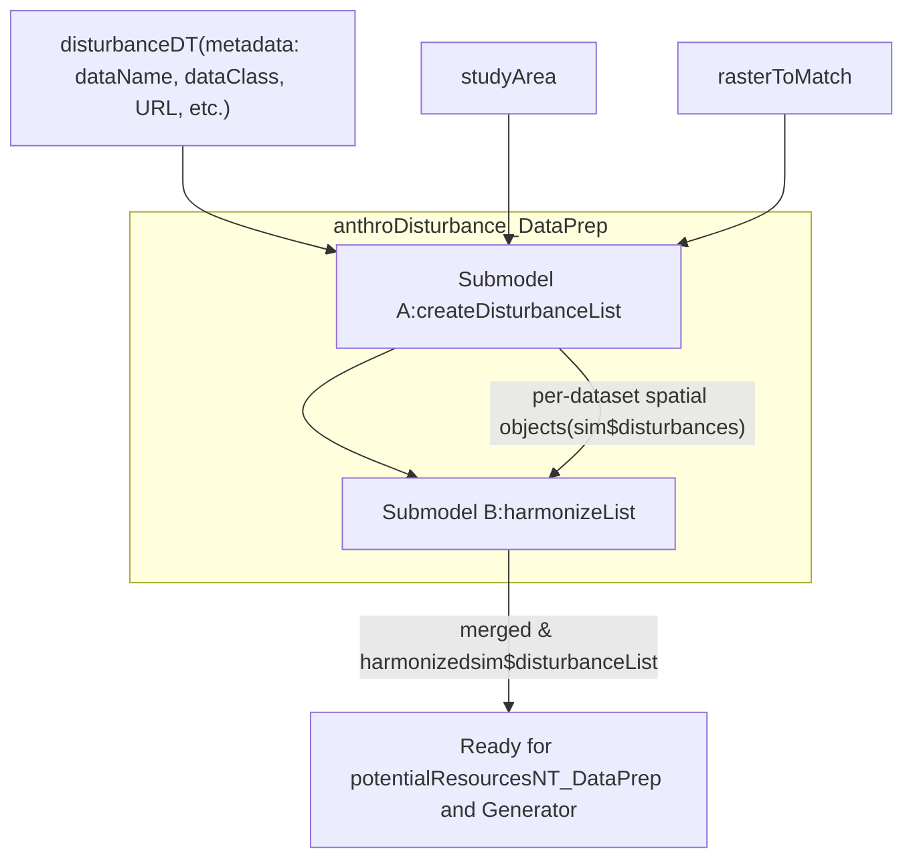
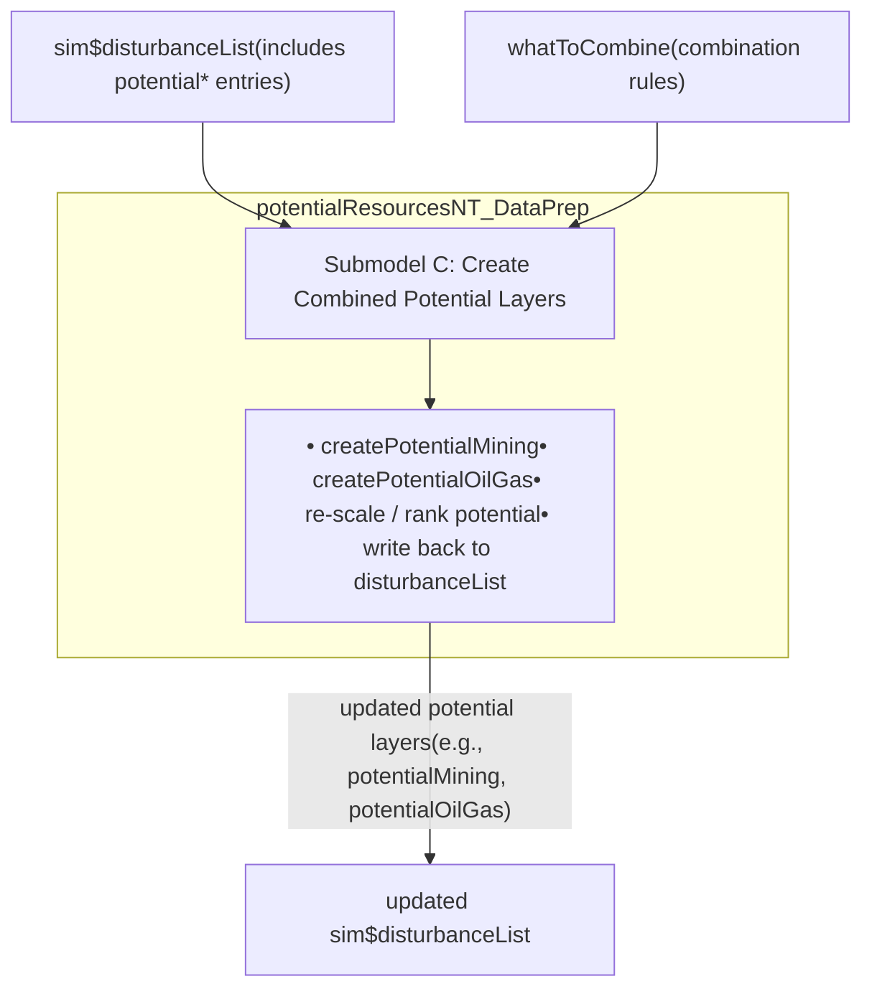
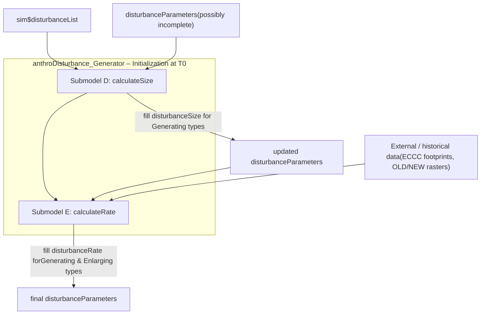
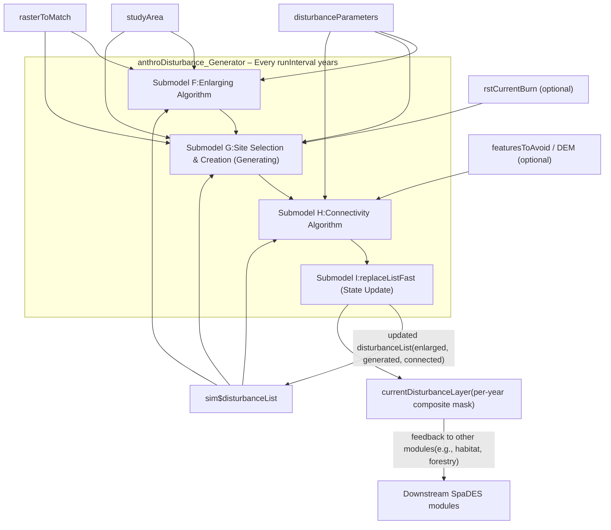

# SpaDES Anthropogenic Disturbance Simulation – Module Workflows

This file sketches workflow diagrams for the modules and submodels described in `docs/Appendix 4 - ODD Model Description of the SpaDES Anthropogenic Disturbance Simulation.docx`. Diagrams are written in Mermaid so they can be rendered in VS Code, RMarkdown, Quarto, or converted to images for the thesis.

---

## 1. High‑Level Simulation Event Flow

```mermaid
flowchart TD
    %% Key data objects
    DDT[disturbanceDT(metadata table)]
    SA[studyArea]
    RTM[rasterToMatch]
    DP[disturbanceParameters]
    DL0[sim$disturbances]
    DL[sim$disturbanceList]
    CPL[combined potential layers]
    CDL[currentDisturbanceLayer(per‑year mask)]

    %% Modules
    subgraph M1["anthroDisturbance_DataPrep (Data Preparation)"]
      A1["Submodel A: createDisturbanceList"]
      A2["Submodel B: harmonizeList"]
      A1 --> A2
    end

    subgraph M2["potentialResourcesNT_DataPrep (Potential Resources)"]
      C1["Submodel C: Create Combined Potential Layers"]
    end

    subgraph M3["anthroDisturbance_Generator (Disturbance Generator)"]
      subgraph Init["Initialization at T0"]
        D1["Submodel D: calculateSize"]
        E1["Submodel E: calculateRate"]
        D1 --> E1
      end
      subgraph Loop["Recurring event loop (every runInterval years)"]
        F1["Submodel F: Enlarging Algorithm"]
        G1["Submodel G: Site Selection & Creation"]
        H1["Submodel H: Connectivity Algorithm"]
        I1["Submodel I: replaceListFast (State Update)"]
        F1 --> G1 --> H1 --> I1
      end
    end

    %% DataPrep
    DDT --> A1
    SA --> A1
    RTM --> A1
    A1 --> DL0
    DL0 --> A2
    A2 --> DL

    %% Potential Resources
    DL --> C1
    C1 --> CPL
    CPL --> DL

    %% Generator init and loop
    DL --> D1
    DP --> D1
    D1 --> DP
    E1 --> DP

    DP --> F1
    DL --> F1
    DL --> G1
    DL --> H1
    F1 --> G1
    G1 --> H1
    H1 --> I1
    I1 --> DL
    I1 --> CDL
```

---

## 2. Data Preparation Module – Disturbance Harmonization



---

## 3. Potential Resources Module – Combined Potential Layers



---

## 4. Disturbance Generator – Initialization (Parameter Calculation)



---

## 5. Disturbance Generator – Recurring Event Loop



